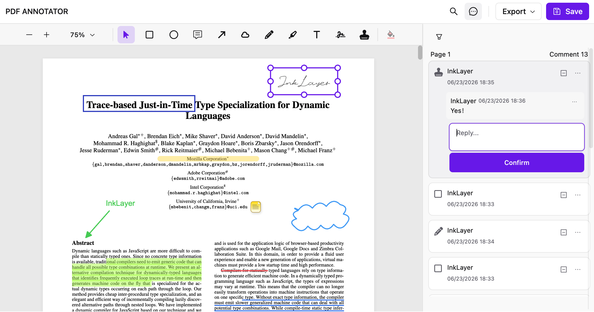

<p align="center">
  
</p>

<h1 align="center">InkLayer Vue</h1>

<p align="center">
  <a href="./README.md">简体中文</a> <span>&nbsp;&nbsp;|&nbsp;&nbsp;</span>
  <a href="./README-en-US.md">English</a>
</p>

<p align="center">
  🖊️ 基于 PDF.js 构建的 Vue 3 PDF 查看与批注 SDK<br/>
  用于快速构建文档审阅、批注与评论系统
</p>

<div align="center">
  <a href="https://www.npmjs.com/package/inklayer-vue" target="_blank">
    
  </a>
  <a href="./LICENSE" target="_blank">
    
  </a>
</div>

<br/>

<div align="center">
  <a href="https://laomai-codefee.github.io/inklayer-vue/" target="_blank"><b>🔥 在线体验</b></a>
  <span>&nbsp;&nbsp;|&nbsp;&nbsp;</span>
  <a href="https://inklayer.dev/docs" target="_blank"><b>📚 文档</b></a>
  <span>&nbsp;&nbsp;|&nbsp;&nbsp;</span>
  <a href="https://github.com/Laomai-codefee/inklayer-vue" target="_blank"><b>⭐ GitHub</b></a>
</div>

---

<p align="center">
  
</p>

## ⭐ 快速开始（推荐）

最快体验 InkLayer Vue 的方式：直接使用 [官方 Starter 🚀 ](https://github.com/Laomai-codefee/inklayer-vue-starter)

```bash
git clone https://github.com/Laomai-codefee/inklayer-vue-starter.git
cd inklayer-vue-starter
npm install
npm run dev
```

打开：

http://localhost:5173

> 💡 Starter 已内置完整 PDF 批注能力示例，无需额外配置即可体验 SDK 全功能。

---

## ✨ 特性

- 🚀 PDF 查看器（缩放 / 搜索 / 主题）
- 🖍️ PDF 批注系统（高亮 / 笔迹 / 图形 / 印章 / 签名）
- 💬 评论与审阅流程
- 💾 批注数据模型（可持久化）
- 📤 导出能力（PDF / Excel）
- 🎨 可自定义 UI（工具栏 / 侧边栏）

---

## 📦 安装

```bash
npm install inklayer-vue
```

---

## 🚀 基础用法

### 1. 插件注册（必须）

```typescript
import { createApp } from 'vue'
import { inklayerVuePlugin } from 'inklayer-vue'
import App from './App.vue'

const app = createApp(App)
app.use(inklayerVuePlugin)
app.mount('#app')
```

### 2. PdfAnnotator（批注）

```vue
<script setup>
import { PdfAnnotator } from 'inklayer-vue'
import 'inklayer-vue/style'

const handleSave = (annotations) => {
  console.log('Saved annotations:', annotations)
}
</script>

<template>
  <PdfAnnotator
    title="PDF Annotator"
    url="https://example.com/sample.pdf"
    :user="{ id: 'u1', name: 'Alice' }"
    @save="handleSave"
  />
</template>
```

---

### 3. PdfViewer（查看器）

```vue
<script setup>
import { PdfViewer } from 'inklayer-vue'
import 'inklayer-vue/style'
</script>

<template>
  <PdfViewer
    title="PDF Viewer"
    url="https://example.com/sample.pdf"
  />
</template>
```

---

## 📖 API 文档

👉 https://inklayer.dev/docs/vue

---

## 🔐 协作批注权限

`user` 代表当前用户，不需要额外传入 `role`。使用 `owner-only` 后，登录用户可新建批注和回复，但只有批注拥有者可移动、缩放、编辑、改状态或删除该批注；回复也只能由其作者编辑或删除。

```vue
<PdfAnnotator
  :user="currentUser"
  :annotation-permissions="{
    mode: 'owner-only',
    can: ({ currentUser }) =>
      currentUser?.id === 'admin' ? true : undefined
  }"
/>
```

`can(request)` 是可选的同步覆盖函数。返回 `true` 强制允许，`false` 强制拒绝，`undefined` 保留 `mode` 的默认结果。`request` 包含 `action`、`currentUser`、`annotation`、`comment` 和 `defaultAllowed`，因此可以接入应用自己的管理员、审批状态或文档级规则。

如果需要整个批注器只读，传入 `:annotation-permissions="{ can: () => false }"`。用户仍可选中和查看批注，但所有写操作都会被禁止。

> 这是浏览器交互权限，用于控制 InkLayer UI 和本地写入。后端 API 仍必须独立验证读写权限，不能把客户端结果当作安全边界。

---

## 🔗 相关项目

- InkLayer React：https://github.com/Laomai-codefee/inklayer-react
- Vue Starter：https://github.com/Laomai-codefee/inklayer-vue-starter
- React Starter：https://github.com/Laomai-codefee/inklayer-react-starter

---

## 💬 反馈

有问题？想提建议？欢迎来 [GitHub Discussions](https://github.com/Laomai-codefee/inklayer-vue/discussions) 聊聊，或者直接发邮件：[codefee@foxmail.com](mailto:codefee@foxmail.com)

Bug 报告请走 [GitHub Issues](https://github.com/Laomai-codefee/inklayer-vue/issues)

---

## 🌐 运行环境

InkLayer Vue 仅支持浏览器环境，不支持 SSR（服务端渲染）。请在客户端入口或仅客户端组件中加载它。

- Vue 3.5+
- Vite 5+ 或 Webpack 5
- ESM 与 CommonJS 包入口
- npm、pnpm 等标准包管理器；项目依赖均由包自身声明

在 Nuxt 等 SSR 框架中使用时，请关闭该组件的服务端渲染，并确保样式与组件只在客户端导入。

---

## 📄 License

MIT © InkLayer
